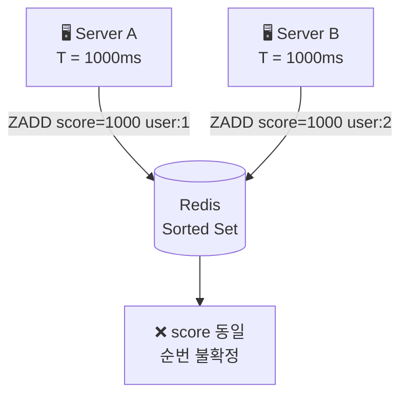
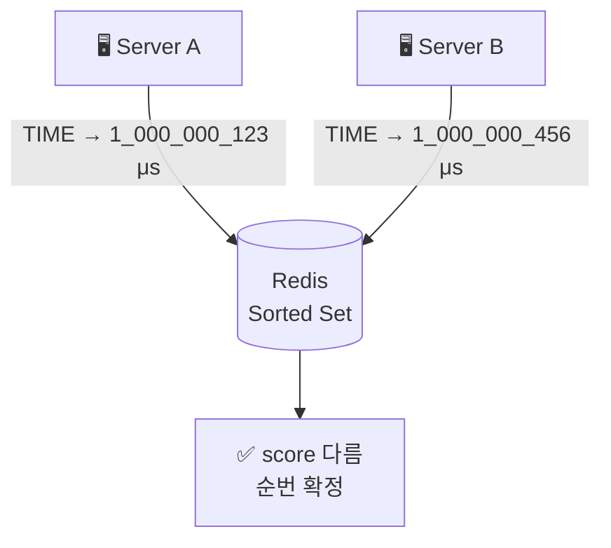

> **TL;DR** 8주차 과제: Redis 기반 대기열 시스템. 트래픽이 몰릴 때 요청을 거절하지 않고 줄 세우는 구조가 필요했다. Kafka가 아닌 Redis Sorted Set을 선택한 이유, Thundering Herd를 어떻게 막았는지, Redis가 장애났을 때 주문 API가 그냥 멈추지 않도록 CircuitBreaker로 격리한 과정을 정리했다.
{: .prompt-tip }

2021년 7월, 50대 코로나 백신 사전예약이 오픈되자마자 수십만 명이 동시에 접속해 서버가 다운됐다. 대기줄을 건너뛰는 방법이 온라인 커뮤니티에 퍼졌다. F12 개발자 도구 콘솔에 한 줄 입력하면 대기열을 무시하고 곧장 예약 화면으로 진입할 수 있었다. 대기열 로직이 프론트엔드 코드에만 있었고, 서버는 아무것도 검증하지 않았기 때문이다.

이 사건이 보여주는 건 두 가지다. 대기열이 없으면 동시 접속에 서버가 버티지 못한다. 그리고 대기열이 있어도 서버에서 강제하지 않으면 우회된다.

---

## Back-pressure: 서버가 감당할 수 있는 속도보다 빠르게 요청이 들어온다

```
[10,000명 동시 접속]
    → POST /orders
    → 재고 확인 & 차감
    → 주문 생성
    → DB 커넥션 풀 고갈
    → 전체 서비스 다운
```

핵심 문제는 **시스템이 처리할 수 있는 속도보다 요청이 더 빠르게 들어온다**는 것이다. 이걸 Back-pressure라고 한다. 하류 시스템(DB, PG)이 감당할 수 있는 속도만큼만 요청을 흘려보내야 하는데, 대기열은 이 Back-pressure를 구현하는 방법 중 하나다.

---

## Rate Limiting과 대기열은 다르다

트래픽 폭증을 막는 방법으로 Rate Limiting이 있다. 초당 N개 이상 들어오면 429로 즉시 거절하는 방식이다. 그런데 대기열과는 목적이 다르다.

| | Rate Limiting | 대기열 |
|---|---|---|
| 초과 요청 처리 | **거절** (429) | **대기** (줄 세움) |
| 사용자 경험 | "나중에 다시 시도하세요" | "현재 512번째입니다" |
| 재시도 | 사용자가 알아서 | 서버가 순서대로 처리 |
| 적합한 상황 | API 보호, 일상적인 속도 제한 | **선착순, 기다릴 의사가 있는 사용자** |

Rate Limiting은 "거절"이고, 대기열은 "기다림"이다. 선착순 이벤트나 티케팅 상황에서는 사용자가 기다릴 의사가 있다. 429를 돌려받고 새로고침을 반복하는 것보다, 줄을 서고 내 차례를 기다리는 게 훨씬 낫다.

> Rate Limiting과 대기열은 배타적이지 않다. 대기열 자체에도 최대 인원(maxQueueSize)을 두어 무한정 대기를 막고, 대기열을 넘어서는 요청은 Rate Limiting으로 거절하면 된다.
{: .prompt-info }

---

## Kafka로 하면 안 되나

7주차에 Kafka로 이벤트 처리를 구현했으니 자연스럽게 드는 질문이다. Kafka도 Producer가 빠르게 넣으면 Consumer가 처리 속도에 맞게 소비하니까, 결국 큐 역할을 하는 것 아닌가?

맞다. 하지만 **대기열에서 필요한 것**이 다르다.

| | Kafka (7주차 이벤트 처리) | Redis 대기열 |
|---|---|---|
| 사용자 관점 | "요청 완료, 결과는 나중에" | "현재 128번째, 약 45초 남음" |
| 순번 조회 | 불가 (offset 기반, 특정 userId 위치 조회 안 됨) | ZRANK로 즉시 조회 |
| 응답 시점 | 비동기 (처리 후 알림) | 실시간 (폴링으로 순번 확인) |
| 핵심 요구 | 처리 완료 보장 | **처리 속도 제어 + 실시간 피드백** |

Kafka는 "내 메시지가 처리됐다"를 보장하는 데 강하다. 하지만 "내가 몇 번째인지", "얼마나 기다려야 하는지"를 실시간으로 알려주는 건 Kafka의 구조와 맞지 않는다. offset은 파티션 내 위치일 뿐, 특정 userId가 몇 번째인지를 O(1)으로 조회할 방법이 없다.

> Kafka로도 구현은 가능하다. 별도 상태 저장소를 두고 Kafka Consumer가 처리 시 순번을 업데이트하는 방식이다. 하지만 "순번 조회"를 위해 별도 저장소를 추가하는 순간 복잡도가 크게 오른다. Redis Sorted Set은 이 요구사항을 데이터 구조 자체가 해결한다.
{: .prompt-tip }

---

## Redis Sorted Set — 데이터 구조가 문제를 해결한다

Redis Sorted Set은 member(userId)와 score(값)로 구성된다. score 순으로 자동 정렬되고, ZRANK로 특정 member의 순위를 O(log N)으로 조회할 수 있다.

대기열에 필요한 연산이 딱 맞아 떨어진다:

```
ZADD  {queue}:waiting  {timestamp}  {userId}   // 대기열 진입
ZRANK {queue}:waiting  {userId}                 // 내 순번 조회 (0-based)
ZCARD {queue}:waiting                           // 전체 대기 인원
```

**score를 진입 시각(마이크로초)**으로 쓰는 이유가 있다. 먼저 들어온 사람이 앞 순번이어야 하니까 자연스럽게 score = 시간이 된다. 그런데 `System.currentTimeMillis()`를 쓰면 문제가 생긴다.

서버가 여러 대일 때, 같은 밀리초에 두 명이 동시에 진입하면 score가 동일해진다:

**❌ System.currentTimeMillis() 사용 시 — score 충돌**



**✅ Redis TIME 사용 시 — score 확정**



> μs는 마이크로초(microsecond). 1ms(밀리초)의 1/1000 단위다. `System.currentTimeMillis()`는 밀리초 단위라 같은 밀리초 안에 두 요청이 들어오면 score가 같아질 수 있지만, Redis TIME은 마이크로초라 훨씬 정밀하게 구분된다.
{: .prompt-info }

그래서 Lua 스크립트로 `ZADD NX + Redis TIME`을 묶어서 실행한다:

```lua
local time = redis.call('TIME')
local score = tonumber(time[1]) * 1000000 + tonumber(time[2])
return redis.call('ZADD', KEYS[1], 'NX', score, ARGV[1])
```

`Redis TIME`은 Redis 서버 자체의 시계를 마이크로초 단위로 반환한다. 다중 서버 환경에서도 하나의 Redis 시계를 사용하므로 score 충돌이 없다.

**NX 옵션**도 핵심이다. 이미 존재하는 userId면 score를 갱신하지 않고 무시한다. 사용자가 불안해서 새로고침을 반복해도 순번이 밀리지 않는다.

---

## 입장 토큰 — 대기열을 통과했다는 증명

대기열에서 순번이 되면 단순히 "됐습니다"로 끝나면 안 된다. 주문 API가 이 사람이 정말 대기열을 거쳤는지 검증해야 한다. 그래서 **입장 토큰**을 발급한다.

```
{queue}:token:{userId}  →  UUID 문자열 (TTL: 5분)
```

스케줄러가 100ms마다 대기열에서 N명을 꺼내 토큰을 발급한다. 사용자는 `GET /queue/position`을 폴링하다가 token 필드가 응답에 포함되면 주문 API를 호출한다.

주문 API에서는 토큰을 검증하고 소비한다. Lua 스크립트로 "값 비교 + 삭제"를 원자적으로 처리한다:

```lua
local stored = redis.call('GET', KEYS[1])
if stored == ARGV[1] then
    redis.call('DEL', KEYS[1])
    return 1
end
return 0
```

원자적으로 처리하는 이유: 같은 사용자가 두 탭에서 동시에 주문 버튼을 눌러도, Lua 스크립트가 원자적으로 실행되므로 둘 중 하나만 토큰을 소비하고 나머지는 INVALID_TOKEN으로 거절된다.

---

## 폴링 주기도 서버가 결정한다

순번 조회 방식으로 Polling, SSE, WebSocket 세 가지를 검토했다.

| | Polling | SSE | WebSocket |
|---|---|---|---|
| 구현 복잡도 | 낮음 | 중간 | 높음 |
| 서버 부하 | 주기마다 요청 발생 | 연결 유지 (커넥션 1개/유저) | 연결 유지 |
| 실시간성 | 주기에 따라 지연 | 이벤트 발생 즉시 | 이벤트 발생 즉시 |

Polling을 선택했다. 대기열 조회는 단방향(서버 → 클라이언트)이고, 구현이 단순하다. SSE가 더 효율적이지만, 대기 인원이 수만 명이면 서버에서 수만 개의 SSE 연결을 유지해야 한다. 커넥션 자체가 자원이다.

다만 Polling의 약점인 서버 부하는 **retryAfterMs 동적 반환**으로 완화했다. 서버가 응답에 "다음 폴링은 N초 뒤에 하세요"를 내려준다:

```kotlin
retryAfterMs = when {
    position <= 100  -> 1_000   // 곧 내 차례 → 1초마다
    position <= 1000 -> 3_000   // 5~6초 내 → 3초마다
    else             -> 5_000   // 한참 남음 → 5초마다
}
```

클라이언트 배포 없이 서버에서만 폴링 주기를 조절할 수 있다. 이벤트 당일 트래픽이 예상보다 많으면 서버 코드만 바꾸면 된다.

---

## Thundering Herd — 대기열이 새로운 폭발을 만든다

대기열이 트래픽을 막아주는 줄 알았는데, 스케줄러가 1초에 175명에게 토큰을 발급하면 175명이 **동시에** 주문 API를 호출한다. 막으려다가 스스로 스파이크를 만드는 셈이다.

이걸 **Thundering Herd** 문제라고 한다. Cache Stampede라고도 부르는데, 캐시가 만료되는 순간 다수의 요청이 동시에 DB로 몰리는 현상과 같은 원리다. Cache Stampede가 캐시 만료 상황에 초점을 맞춘 표현이라면, Thundering Herd는 여러 프로세스가 동시에 같은 자원을 향해 몰리는 현상 전반을 부르는 더 넓은 표현이다.

해결 방법은 단순했다. **발급 간격을 쪼갠다.**

```
AS-IS: 1초에 175명 한 번에 발급
TO-BE: 100ms마다 18명씩 발급 → 초당 총 180명, 균등 분산
```

한 번에 175명을 쏟아내는 대신, 100ms마다 18명씩 발급하면 주문 API에 가해지는 순간 부하가 175분의 18 수준으로 낮아진다.

배치 크기 18은 실제로 산정한 값이다:
- DB 커넥션 풀: 40개
- 주문 1건 평균 처리 시간: ~200ms
- 이론적 최대 TPS: 40 ÷ 0.2 = 200
- 안전 마진 87.5%: 175 TPS
- 스케줄러 주기 100ms: 175 ÷ 10 = **17.5 → 18명**

> 대기열은 트래픽을 **평탄화(smoothing)**하는 도구다. 잘못 만들면 대기열 자체가 주기적인 스파이크를 만든다.
{: .prompt-warning }

---

## 서버가 죽으면 줄 서던 사람들은 어디로 가나

스케줄러가 대기열에서 18명을 꺼낸 직후 서버가 죽으면 어떻게 될까:

```
1. waiting에서 18명 제거됨
   ← 서버 죽음
2. 토큰 발급 실패

결과: 18명이 대기열에서 사라졌는데 토큰도 없음
     → 영원히 응답 없음, 다시 진입하면 맨 뒤로
```

이 문제를 **Staging Area 패턴**으로 해결했다. AWS SQS의 [Visibility Timeout](https://docs.aws.amazon.com/AWSSimpleQueueService/latest/SQSDeveloperGuide/sqs-visibility-timeout.html)과 같은 원리다.

```
{queue}:waiting     → 대기 중 (정상 상태)
{queue}:processing  → 처리 중 (토큰 발급 진행 중)
```

| SQS | 우리 구현 |
|---|---|
| Invisible 상태 | `{queue}:processing` Sorted Set |
| Visibility Timeout | score(claimed_at) 기준 만료 |
| DeleteMessage | removeFromProcessing() |
| 재처리 | 복구 스케줄러 → waiting으로 복구 |

스케줄러는 `waiting → processing → 토큰 발급 → processing 삭제` 순서로 동작한다. 서버가 중간에 죽으면 processing에 항목이 남는다. 10초마다 실행되는 복구 스케줄러가 processing에서 오래된 항목을 감지해 waiting으로 돌려놓는다.

복구된 유저는 현재 대기열 맨 뒤 순번을 받는다. 원래 순번을 복원하려면 processing에 originalScore도 저장해야 하는데, 서버 장애라는 극히 드문 케이스 대비 구현 복잡도가 크다고 판단해 감수했다.

---

## 배포 없이 대기열 ON/OFF

처음 구현은 이렇게 생겼다:

```kotlin
// 기존 — 토큰 유무를 클라이언트가 결정
if (criteria.entryToken != null) {
    queueService.validateAndConsumeToken(userId, criteria.entryToken)
}
```

두 가지 문제가 있었다. 첫째, 대기열을 켜고 끄려면 코드를 바꿔서 배포해야 한다. 트래픽이 갑자기 몰릴 때 즉각 대응이 안 된다. 둘째, 대기열이 켜진 상태에서 클라이언트가 토큰을 안 보내면 그냥 통과된다. 구버전 앱이나 개발 실수로 토큰 없이 요청이 들어오면 DB에 그대로 부하가 간다.

```kotlin
// 변경 후 — 대기열 활성 여부를 서버가 결정
if (queueCircuitBreakerAdapter.isQueueEnabled()) {
    val token = criteria.entryToken
        ?: throw CoreException(ErrorType.INVALID_TOKEN)
    queueService.validateAndConsumeToken(userId, token)
}
```

`{queue}:enabled` Redis 키로 상태를 관리한다. 어드민 API로 값만 바꾸면 배포·재시작 없이 즉시 반영된다. Feature Flag 시스템(GateKeeper, LaunchDarkly 등)에서 쓰는 개념인데, Redis 키 하나로 단순하게 구현했다.

---

## Redis 장애 시 주문 API도 멈춰야 할까

여기서 한 가지 더 고민했다. `isQueueEnabled()`를 호출할 때 Redis가 장애 중이면 어떻게 될까. Redis 호출이 실패하면 예외가 던져지고, 주문 API 전체가 막혀버린다.

대기열 인프라(Redis)의 장애가 주문 API로 전파되는 것이다.

이걸 막기 위해 Resilience4j CircuitBreaker를 `isQueueEnabled()` 호출에만 붙였다. Redis가 불안정해지면 CircuitBreaker가 감지해서 fallback으로 전환한다. fallback은 단순히 `false`를 반환한다.

```kotlin
@Component
class QueueCircuitBreakerAdapter(private val queueService: QueueService) {

    @CircuitBreaker(name = "queue-redis", fallbackMethod = "isQueueEnabledFallback")
    fun isQueueEnabled(): Boolean = queueService.isQueueEnabled()

    private fun isQueueEnabledFallback(e: Throwable): Boolean {
        log.warn("Redis 장애로 대기열 상태 조회 실패, 대기열 비활성화로 처리: {}", e.message)
        return false  // 대기열 비활성화로 간주 → 주문 통과
    }
}
```

`false`가 반환되면 대기열이 비활성화된 것으로 간주해 토큰 검증 없이 주문이 통과된다.

| 상황 | 동작 |
|---|---|
| 대기열 활성 + Redis 정상 | 토큰 필수 검증 |
| 대기열 비활성 + Redis 정상 | 토큰 검증 생략 (어드민 OFF) |
| Redis 장애 (CircuitBreaker OPEN) | 토큰 검증 생략 (fallback) |

한 가지 접근 방식이지만, 생각해보면 문제가 있다. Redis가 장애난 상황이 하필 대규모 이벤트 중이라면, 대기열에 수만 명이 쌓여 있는 상태에서 CircuitBreaker가 열리는 순간 토큰 없이 모든 요청이 주문 API로 쏟아진다. 대기열 없이 트래픽이 몰렸을 때와 똑같은 상황이 된다. 오히려 더 큰 장애로 이어질 수 있다.

fail-open(장애 시 통과)이냐 fail-closed(장애 시 차단)냐의 트레이드오프인데, 어느 쪽도 완전한 답이 아니다. 더 나은 방법은 Redis 장애를 감지했을 때 대기열을 우회하되, 동시에 주문 API 자체에 Rate Limit을 걸어 서버 처리량을 초과하지 않도록 제어하는 것이다. 혹은 Redis를 고가용성(HA) 구성으로 운영해 단일 장애점 자체를 없애는 방향이 더 근본적인 해결책일 수 있다.

여기서 한 가지 설계 포인트가 있다. `@CircuitBreaker`는 Spring AOP 프록시 기반으로 동작한다. 같은 클래스 내부에서 자기 메서드를 호출하면 프록시를 타지 않아 어노테이션이 동작하지 않는다(self-invocation 문제). 그래서 `QueueCircuitBreakerAdapter`를 별도 빈으로 분리했다. `OrderFacade`가 이 어댑터를 주입받아 호출하면, 스프링 프록시를 거쳐 CircuitBreaker가 정상 동작한다.

---

## active-count drift — 카운터가 조용히 어긋난다

대기열을 구현하면서 예상치 못한 문제를 하나 발견했다. 활성 토큰 수를 추적하기 위해 `{queue}:active-count` 카운터를 쓰는데, 이 카운터가 시간이 지나면서 실제 토큰 수와 어긋난다.

원리는 이렇다:
1. 토큰 발급 → `active-count` INCR
2. 주문 완료 → `active-count` DECR
3. **토큰 TTL 만료 → Redis가 키를 삭제하지만 `active-count`는 자동으로 DECR되지 않는다**

사용자가 토큰을 받고 5분 안에 주문하지 않으면, 토큰은 만료되어 사라지지만 카운터는 그대로 남는다. 이런 경우가 쌓이면 실제 활성 토큰은 100개인데 카운터는 150으로 부풀어 있는 상태가 된다.

정확한 카운터를 원하면 `SCAN {queue}:token:*`으로 실제 키 개수를 직접 세면 된다. 하지만 SCAN은 전체 키를 순회하는 O(N) 연산이라, 수만 명 규모에서 100ms마다 돌리면 Redis에 부담이 크다.

이 drift는 항상 카운터가 **높아지는 방향**으로만 발생한다. 실제보다 높으면 스케줄러가 자리가 더 부족하다고 판단해 토큰을 과소 발급한다. 반대로 카운터가 낮아지는 drift라면 과하게 발급해서 서버 보호라는 목적이 깨지는데, 이 방향은 발생하지 않는다. 대기열의 목적(서버 보호)에는 벗어나지 않는 트레이드오프로 판단했다.

---

## 트레이드오프 정리

이번 구현에서 의도적으로 감수한 것들:

| 트레이드오프 | 선택한 이유 |
|---|---|
| active-count drift (카운터 오차) | SCAN O(N) 대신 "과소 발급" 방향 오차는 허용 |
| 복구 후 순번 밀림 | 서버 장애는 극히 드문 케이스, originalScore 저장 복잡도 비용이 더 큼 |
| maxQueueSize 일시 초과 | 복구 시 원래 있던 사람이 돌아오는 것, 새 유입이 아님 |
| Polling 실시간성 한계 | SSE 연결 유지 비용 대비, retryAfterMs로 주기 조절로 충분 |

---

## 돌아보며

대기열을 처음 구현해보면서 "줄 세우는 것"이 단순해 보여도 실제로는 꽤 많은 고민이 필요하다는 걸 느꼈다. 순번 보장, Thundering Herd, 서버 장애 복구, Redis 자체 장애 격리까지. 각 단계마다 "이 경우엔 어떻게 되지?"를 계속 물어보는 과정이었다.

뉴스에서 티케팅 사이트 장애를 볼 때 왜 그게 어려운 문제인지 막연하게만 알았는데, 직접 구현해보니 어떤 포인트에서 무엇이 터지는지 구체적으로 보이기 시작했다.

---

## References

| | 링크 |
|---|---|
| Redis Sorted Set | [redis.io/docs/data-types/sorted-sets](https://redis.io/docs/latest/develop/data-types/sorted-sets/) |
| Redis Pipelining | [redis.io/docs/manual/pipelining](https://redis.io/docs/manual/pipelining/) |
| AWS SQS Visibility Timeout | [docs.aws.amazon.com - SQS Visibility Timeout](https://docs.aws.amazon.com/AWSSimpleQueueService/latest/SQSDeveloperGuide/sqs-visibility-timeout.html) |
| Virtual Waiting Room | [System Design Newsletter - Virtual Waiting Room](https://newsletter.systemdesign.one/p/virtual-waiting-room) |
| 지마켓 대기열 시스템 | [dev.gmarket.com - 선착순 이벤트 시스템](https://dev.gmarket.com/46) |
| Feature Flags | [martinfowler.com - Feature Toggles](https://martinfowler.com/articles/feature-toggles.html) |
| 백신 예약 서버 다운 (YTN) | [백신 접종 예약 시스템 서버 다운...최대 20만 명 넘게 접속](https://www.ytn.co.kr/_ln/0103_202107120226340831) |
| 백신 예약 우회 방법 (머니투데이) | ['뒷문' 또 뚫린 백신 예약시스템…전문가 "너무 허술"](https://www.mt.co.kr/tech/2021/07/20/2021072014315497164) |
| 백신 예약 비공식 루트 (세계일보) | ['제어판'부터 '비행기 모드'까지…백신 예약 먹통에 등장한 비공식 루트](https://www.segye.com/newsView/20210720512057) |
