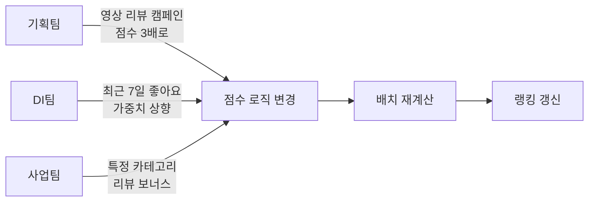
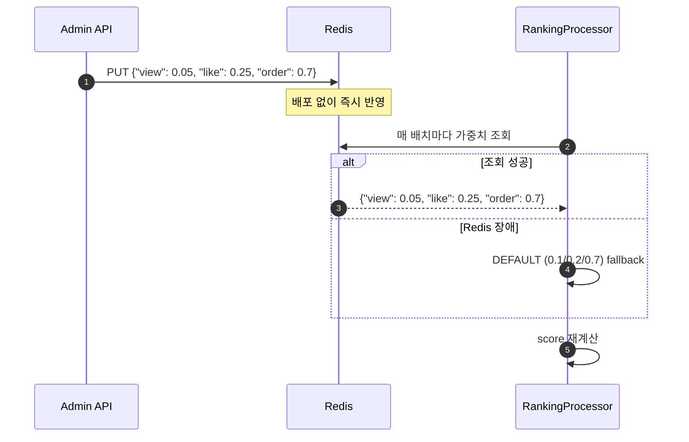

> **TL;DR** 💡 가중치 합산(0.1/0.2/0.7)과 점수제(1/2/7)는 수학적으로 동치다. 순위는 바뀌지 않는다. 그런데 운영하다 보면 스케일 통제, 지표 추가, 랭킹판 조합에서 차이가 드러난다. 점수 공식은 다음 달에 바뀔 수 있다. 개발자가 집중해야 할 건 공식이 아니라 구조다.
{: .prompt-tip }

## 같은 "인기 순위"인데 점수 체계가 다르다

이번 주차 과제는 Redis ZSET 기반 랭킹 시스템이었다. 발제에서 제시된 점수 공식은 이랬다.

```
조회: Weight = 0.1
좋아요: Weight = 0.2
주문: Weight = 0.7
```

총합 1.0으로 맞춘 가중치 합산이다. 흔히 보는 형태라 자연스럽게 따라갔다.

그런데 회사에서 운영 중인 랭킹 시스템은 전혀 다른 방식이다.

### 상품 랭킹 — ORDER BY 체인

상품 랭킹은 가중치 합산이 아니라 **다중 정렬 기준(ORDER BY 체인)**으로 되어 있다.

```sql
ORDER BY
  SUM(orderCount) DESC,          -- 1순위: 주문 수
  SUM(feedbackTotal.count) DESC,  -- 2순위: 리뷰 수
  SUM(searchCount) DESC,          -- 3순위: 조회 수
  SUM(favoriteCount) DESC,        -- 4순위: 찜 수
  goodsId DESC                    -- 5순위: 안정 정렬
```

단일 score로 합산하는 게 아니라, "주문 수가 같으면 리뷰 수로 비교하고, 그것도 같으면 조회 수로..."라는 우선순위 체인이다. 이 경우 **주문 1건 차이가 조회 수 10만 건 차이보다 우선**한다.

### 리뷰어 랭킹 — 점수가 수시로 바뀌는 세계

리뷰어 점수 체계는 더 복잡하다. 가중치 합산도, 단순 ORDER BY 체인도 아닌, **오래된 리뷰일수록 점수가 깎이는 시간 감쇠(time decay) 기반 가산**이다.

```
리뷰 1건의 점수 = (리뷰 평점 + 좋아요 수 + 베스트 보너스) × 날짜 가중치
리뷰어 총점 = Σ(각 리뷰 점수) + 최근 7일 좋아요 수
```

날짜 가중치 테이블:

| 리뷰 작성 시점 | 가중치 |
|--------------|--------|
| 1개월 미만 | 1.0 |
| 1~3개월 | 0.7 |
| 3~6개월 | 0.5 |
| 6~12개월 | 0.3 |
| 12개월 이상 | 0.0 |

12개월 이상 된 리뷰는 가중치 0.0으로 **점수에서 완전히 사라진다**. 최근 리뷰일수록 높은 가중치를 받아서 "지금 활발한 리뷰어"가 상위에 올라가는 구조다. 연속적인 지수 감쇠가 아니라 구간별 계단식(step function)인데, 데이터팀이나 기획팀에서 "3개월 미만은 0.7, 6개월 미만은 0.5"처럼 구간을 정의하고 개발자가 구현하는 구조이기 때문이다. 연속 함수보다 기획 의도가 명확하고, 변경 요청이 와도 영향 범위를 바로 파악할 수 있다.

그런데 이 점수 체계는 단순히 기술적 설계가 아니다. 리뷰어 랭킹 뒤에는 비즈니스 전략이 깔려 있다.

| 전략 | 동작 | 점수에 미치는 영향 |
|------|------|-----------------|
| **리뷰 작성률 유도** | 포토/영상 리뷰에 추가 포인트 지급 프로모션 | 리뷰 유형별 점수 배분 변경 |
| **경쟁 심리 자극** | "이번 달 TOP 리뷰어" 노출. 내 순위가 보임 | 리뷰어가 더 열심히 쓰게 되는 의도된 설계 |
| **어뷰징 방지** | 글자수 채우기, 욕설, 불법 촬영물 필터링 | 별도 필터링이지만 점수와 맞물려 동작 |

그리고 이 점수 계산식은 **고정된 게 아니다.**



이 점수 체계에서 "합이 1"이라는 제약은 전혀 없다. 리뷰를 많이 쓸수록 총점이 올라가고, 최근 리뷰일수록 더 높은 점수를 받는 순수한 **가산(additive) 점수제**다. 그리고 그 가산 규칙은 비즈니스 요구에 따라 수시로 변한다.

---

## 세 가지 방식이 공존한다

정리하면 이렇다.

| 시스템 | 방식 | 특징 |
|--------|------|------|
| 상품 랭킹 | ORDER BY 우선순위 체인 | 단일 score 없음. 기준 간 우선순위가 절대적 |
| 리뷰어 점수 | 시간 감쇠 기반 가산 | 건수가 많을수록 유리. 합산 상한 없음. 수시 변경 |
| 과제 발제 | 가중치 합산 (합=1) | 모든 지표를 단일 score로 압축 |

세 가지 모두 "인기 순위"를 매기는 건 같은데, 점수 체계가 완전히 다르다.

---

## 수학적으로 같은 것과 다른 것

먼저 혼동하기 쉬운 부분을 정리하자.

**가중치 합산과 점수제는 수학적으로 동치다.** 모든 점수에 같은 상수를 곱해도 순위는 변하지 않는다.

```
가중치제: score = 0.1 × view + 0.2 × like + 0.7 × order
점수제:   score = 1 × view + 2 × like + 7 × order
```

두 번째 수식은 첫 번째에 10을 곱한 것이다. 모든 상품의 점수가 동시에 10배가 되니까 순위는 바뀌지 않는다. 구체적으로 확인해보면:

| 상품 | view | like | order | 가중치제 | 점수제 | 순위 |
|------|------|------|-------|---------|--------|------|
| A | 100 | 30 | 5 | 19.5 | 195 | 2등 |
| B | 50 | 10 | 10 | 14.0 | 140 | 3등 |
| C | 200 | 50 | 8 | 35.6 | 356 | 1등 |

점수는 10배 차이나지만 순위는 동일하다.

> 모든 점수에 같은 양수 상수를 곱하는 것은 순위에 영향을 주지 않는다.
{: .prompt-info }

**하지만 ORDER BY 체인과 가중치 합산은 수학적으로 다르다.** "주문 수가 같을 때만 리뷰 수를 비교"하는 구조는, 가중치 합산과 다른 순위를 만들 수 있다.

```
상품 A: 주문 10건, 조회 1,000회
상품 B: 주문 11건, 조회 0회

ORDER BY 체인: B 1등 (주문 수 우선)
가중치 합산:   A 1등 (0.7×10 + 0.1×1000 = 107 > 0.7×11 = 7.7)
```

ORDER BY 체인에서는 주문 1건 차이가 조회 수 어떤 값보다 우선한다. 가중치 합산에서는 조회 수 1,000회가 `0.1 × 1000 = 100`점이 되어 주문 1건 차이(`0.7`)를 가볍게 뒤집는다. **어느 쪽이 "맞는" 인기 순위인지는 비즈니스 판단이다.**

---

## 가중치 합산과 점수제: 순위는 같은데 왜 선택이 필요한가

수학적 동치인 두 방식 사이에서 선택이 필요한 이유는 **운영** 때문이다.

### 가중치제가 유리한 경우

**스케일 통제.** 가중치제는 값이 0~1 사이에 자연스럽게 머문다. 점수제는 경계가 없어서 값이 커질 유혹이 있다. 회사 리뷰 점수에서도 텍스트 50점 → 포토 100점 → 영상 200점으로 올라가는데, 라이브 리뷰가 추가되면 400점? 500점? "이 지표에 몇 점이 적절한가"에 대한 객관적 기준이 없다.

**여러 랭킹판 조합.** "일간 랭킹 × 0.3 + 주간 랭킹 × 0.7 = 종합 랭킹"처럼 여러 랭킹을 합칠 때, 가중치제는 스케일이 이미 맞아서 그냥 합치면 된다. 점수제는 일간과 주간의 스케일이 달라서 합칠 때마다 재정규화가 필요하다.

**상대 비중 즉시 파악.** `order = 0.7`은 "주문이 전체의 70%를 결정한다"로 바로 읽힌다. `order = 7`은 "전체 중 몇 %?"를 계산해야 안다.

### 점수제가 유리한 경우

**새 지표 추가가 쉽다.** "카트 담기 3점"을 한 줄 추가하면 끝이다. 가중치제는 전체를 재분배해야 한다.

```
점수제:   cart = 3 한 줄 추가. 기존 점수 그대로.
가중치제: view 0.1→0.077, like 0.2→0.154, order 0.7→0.538, cart 0.231
         기존 값 전부 변경.
```

리뷰 점수처럼 비즈니스 요구에 따라 지표가 수시로 추가/변경되는 환경에서는 이 차이가 크다. "이번 달 영상 리뷰 캠페인이니까 영상 점수를 3배로" 같은 요구에 가중치제로 대응하려면 전체를 매번 재계산해야 한다. 점수제는 해당 항목 값만 바꾸면 된다.

**부동소수점 정밀도.** `0.1 + 0.2 == 0.30000000000000004`는 프로그래밍에서 유명한 함정이다. 점수제는 정수 연산으로 이 문제를 회피한다.

**비즈니스 직관성.** "사진 리뷰는 텍스트의 2배 가치"라는 표현이 50점 vs 100점으로 즉시 이해된다. 비개발자(기획, MD)가 직접 값을 조정하는 환경에서는 이 차이가 크다.

---

## 정리

| 관점 | 가중치제 | 점수제 |
|------|---------|--------|
| 순위 결과 | 동일 | 동일 |
| 스케일 통제 | ✅ 0~1 범위 | 무한정 커질 수 있음 |
| 여러 랭킹판 조합 | ✅ 스케일 맞음 | 재정규화 반복 |
| 상대 비중 표현 | ✅ 즉시 % 파악 | 계산 필요 |
| 새 지표 추가 | 전체 재분배 | ✅ 한 줄 추가 |
| 부동소수점 | 오차 가능 | ✅ 정수 연산 |
| 비즈니스 직관성 | % 기반 | ✅ 배수 기반 |
| 빈번한 변경 대응 | 재분배 필요 | ✅ 로컬 변경 |

---

## 개발자가 집중해야 하는 건 계산식이 아니다

회사에서 리뷰 점수 체계를 운영하면서 느낀 건, **점수 계산식은 생각보다 자주 바뀐다**는 것이다.

기획팀에서 리뷰 작성률을 올리고 싶으면 포토/영상 리뷰의 점수를 올린다. 사업팀에서 특정 카테고리를 밀고 싶으면 해당 카테고리 리뷰에 보너스를 준다. DI팀에서 리뷰어 랭킹의 경쟁 강도를 조정하고 싶으면 시간 감쇠율을 바꾼다. 어뷰징이 늘면 최소 글자수 기준이나 필터링 로직이 추가된다.

이런 변경이 한 달에도 몇 번씩 올 수 있다. 개발자가 "최적의 점수 공식은 무엇인가"에 몰두하는 건 의미가 없다. **그 공식은 다음 달에 바뀔 수 있으니까.** 실제로 점수 계산 공식을 정밀하게 다듬는 건 데이터팀이나 기획팀의 영역이다.

개발자가 집중해야 하는 건 다른 곳에 있다.

- **계산식이 바뀌어도 배포 없이 반영할 수 있는 구조**인가
- **수백만 건의 이벤트를 실시간으로 집계할 수 있는 파이프라인**인가
- **Redis가 죽어도 원장(DB)에서 재구축 가능한 설계**인가
- **트래픽이 몰려도 랭킹 API가 버틸 수 있는 서빙 구조**인가

이번 과제에서도 이 관점으로 접근했다. 가중치 값을 코드에 하드코딩하지 않고, **Redis에 JSON으로 저장하여 Admin API로 배포 없이 변경 가능한 구조**를 만들었다.

```
Redis key: ranking:weights
    value: {"view": 0.1, "like": 0.2, "order": 0.7}
```



0.1/0.2/0.7이라는 숫자 자체가 중요한 게 아니라, **그 숫자가 바뀌었을 때 시스템이 얼마나 유연하게 대응하느냐**가 핵심이다.

그러면 가중치가 바뀌었을 때, Redis ZSET에 이미 적재된 기존 점수는 어떻게 되는가?

이 시스템에서는 원장(`product_metrics`)을 SSOT로 두고 score를 매번 재계산하는 구조다. 가중치가 바뀌어도 DB 풀스캔 → 새 수식으로 재계산 → ZADD 덮어쓰기로 전체 랭킹을 재구축할 수 있다.

```
가중치 변경 (0.1/0.2/0.7 → 0.05/0.25/0.7)
  → product_metrics 풀스캔
  → 새 수식으로 score 재계산
  → ZADD 덮어쓰기 (기존 score 교체)
  → 랭킹 즉시 반영
```

가중치 변경에 대응할 수 있는 건, 처음부터 SSOT를 DB에 두고 ZSET을 파생 데이터로 설계했기 때문이다.

> 발제에서 "점수 계산에 사용되는 Weight를 어떻게 수정할 수 있을지 고민해보기"가 Nice-to-Have로 제시된 이유도 이거라고 생각한다. 계산식의 완성도가 아니라, 계산식의 변경 가능성을 설계에 반영하라는 의미다.
{: .prompt-info }

---

## 왜 이 시스템에서 가중치제를 유지했나

과제에서 점수제로 전환하는 것도 고려했지만, 두 가지 이유로 가중치제를 유지했다.

1. **시간 단위 랭킹 확장**: Nice-to-Have로 일간+시간 두 윈도우를 만들었다. 두 랭킹판을 합칠 가능성이 있으면 스케일이 맞는 가중치제가 유리하다
2. **가중치 동적 조절**: Admin API로 가중치를 변경하는 기능을 구현했는데, "전체 대비 비중"을 보여주는 관점에서 가중치제가 적합하다

다만 "합이 1이어야 한다"는 건 관습이지 필연이 아니다. 새 지표를 추가할 때 합이 1을 넘어가도 순위에는 영향 없다. 핵심은 비율이지 합계가 아니다.

회사에서 점수제가 운영되는 걸 보면, 실제로 지표가 자주 추가/변경되는 환경에서는 점수제가 더 실용적일 수 있다. 도메인과 운영 환경에 따라 결정할 문제이지, 수학적 우열이 있는 건 아니다.

---

## 결론

같은 "인기 순위"를 매기는 시스템에서도 점수 설계가 전혀 다를 수 있다. 가중치 합산, 점수제, ORDER BY 체인, 시간 감쇠 가산 — 각각 저장소 특성과 비즈니스 의도에 따라 선택된다.

| 상황 | 추천 |
|------|------|
| ZSET 같은 단일 score 저장소 | 가중치 합산 or 점수제 |
| DB ORDER BY로 배치 계산 | ORDER BY 체인 |
| "최근 활동"이 중요한 도메인 | 시간 감쇠 가산 |
| 비개발자가 직접 조정 | 점수제 |
| 여러 랭킹판을 합쳐야 함 | 가중치 합산 |
| 지표가 자주 추가/제거 | 점수제 |

그리고 어떤 방식을 쓰든, 개발자가 집중해야 할 건 **계산식의 완성도가 아니라 계산식이 바뀌었을 때의 유연성**이다. 점수 공식은 다음 달에 바뀔 수 있지만, 데이터 파이프라인과 서빙 구조는 남는다.

> 점수 공식은 다음 달에 바뀔 수 있다. 데이터 파이프라인과 서빙 구조는 남는다.
{: .prompt-tip }
