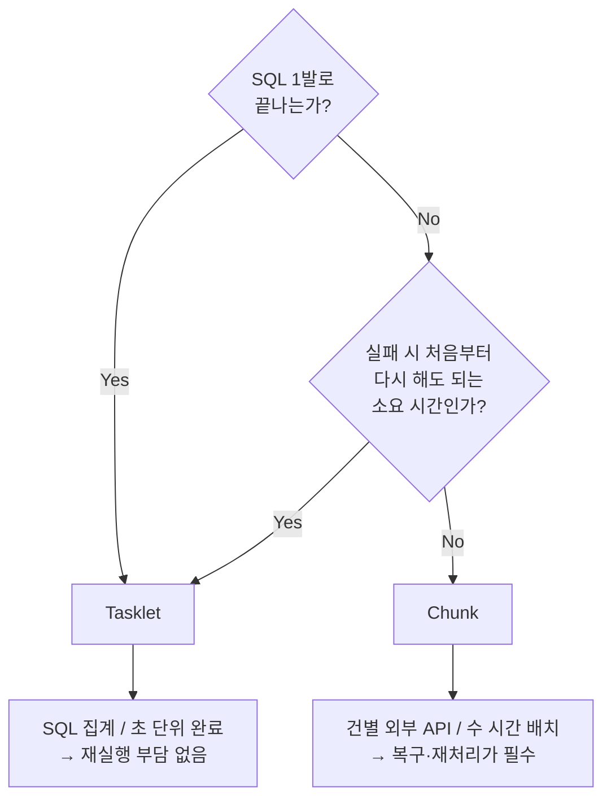

> **TL;DR** 배치에서 정확성은 필수다. Chunk와 Tasklet 모두 같은 정확한 결과를 만든다. 차이는 실패했을 때 어디서부터 다시 하느냐. 두 방식을 구현하고 벤치마크까지 돌려본 뒤, 우리 케이스에서는 Tasklet이 적절하다는 결론을 내렸다.
{: .prompt-tip }

---

## Spring Batch는 왜 Chunk를 강조하는가

Spring Batch 공식 문서는 Chunk-oriented Processing을 이렇게 정의한다.

> Chunk-oriented processing refers to reading the data one at a time and creating 'chunks' that are written out within a transaction boundary.
>
> (데이터를 하나씩 읽어 'chunk'로 묶고, 트랜잭션 경계 안에서 기록하는 처리 방식)
>
> — [Spring Batch Reference](https://docs.spring.io/spring-batch/reference/step/chunk-oriented-processing.html)

배치는 빠른 게 목적이 아니다. **처리 도중 실패해도 복구할 수 있고, 재처리가 가능하고, 결과가 정확해야 한다.** Chunk가 이걸 보장하는 방식이 트랜잭션 경계 + 메타 테이블 기반 재시작이다.

| 관점 | chunk 커밋 없으면 | chunk 커밋 있으면 |
|------|-----------------|-----------------|
| **메모리** | 전체를 한 번에 올림 | chunk만큼만 유지 |
| **트랜잭션** | 하나의 긴 트랜잭션 | chunk마다 짧게 끊음 |
| **실패 복구** | 전부 롤백, 처음부터 | 마지막 커밋 chunk부터 이어감 |
| **모니터링** | 성공/실패만 보임 | chunk별 진행률 추적 |

> 배치의 핵심 가치는 속도가 아니라 **복구 가능성, 재처리, 정확성**이다.
> Chunk는 이 세 가지를 트랜잭션 단위로 보장하는 구조다.
{: .prompt-info }

---

## 배치를 처음 만들었다

이번 주차 과제는 Spring Batch로 주간/월간 랭킹을 집계하는 것이었다.

일간 랭킹은 이미 Redis ZSET으로 실시간 서빙하고 있었다.
주간/월간은 `product_metrics` 테이블을 합산해서
MV 테이블에 TOP 100을 적재하면 된다.

Spring Batch를 실무에서 써본 적은 있지만,
직접 Job을 설계하고 구현해본 건 이번이 처음이다.
처음이니까 공식 문서의 표준 패턴대로 갔다.

---

## Chunk로 시작했다

Chunk-Oriented Processing으로 3-Step Job을 구현했다.


| Step | 방식 | 역할 |
|------|------|------|
| Step 1 | Chunk | `product_metrics` 기간 합산 + score 계산 + 중간 테이블 저장 |
| Step 2 | Tasklet | 중간 테이블에서 TOP 100 정렬 + MV에 적재 |
| Step 3 | Tasklet | 이전 version 삭제 |

Step 1을 Chunk로 만든 이유가 있다.
전체 상품의 score를 한 번에 볼 수 없으니 rank를 바로 매길 수 없다.
중간 테이블에 모든 상품의 score를 모은 뒤, Step 2에서 정렬하고 TOP 100에 rank를 부여한다.

복구 가능성, 재처리, 정확성. 셋 다 챙긴 구조라고 생각했다.

---

## 의문이 들었다

구현을 끝내고 보니 걸리는 게 있었다.

우리가 하는 건 결국 이거다.

```sql
SELECT product_id,
       SUM(like_count), SUM(order_count), SUM(view_count)
FROM product_metrics
WHERE metric_date BETWEEN '2026-04-06' AND '2026-04-12'
GROUP BY product_id
ORDER BY score DESC
LIMIT 100
```

SQL 1발이면 DB가 혼자 다 할 수 있다.

이걸 Reader로 1000건씩 읽고,
Processor에서 score 계산하고,
Writer로 중간 테이블에 쓰고,
다시 Step 2에서 읽어서 MV에 적재한다.

DB가 잘하는 일을 앱이 나눠서 하고 있는 건 아닌가?

> Chunk의 Reader/Processor/Writer 분리는 앱에서 건별 처리가 필요할 때 빛난다.
> DB가 혼자 집계할 수 있는 상황에서는 오히려 오버헤드다.
{: .prompt-warning }

Tasklet 버전을 대안으로 만들었다.
SQL 1발로 집계 + rank + MV 적재까지 한 번에.

---

## 벤치마크를 돌렸다

의문만 가지고 있으면 답이 안 나온다. 같은 데이터에서 두 방식을 돌려봤다.

**환경**: Testcontainers MySQL 8.0, 상품 수 x 7일치 데이터

| 상품 수 | 행 수 | Chunk | Tasklet | 배수 |
|--------:|------:|------:|--------:|-----:|
| 1,000 | 7,000 | 2,238ms | 174ms | 12.9x |
| 5,000 | 35,000 | 4,684ms | 174ms | 26.9x |
| 10,000 | 70,000 | 7,172ms | 215ms | 33.4x |
| 50,000 | 350,000 | 57,338ms | 653ms | 87.8x |
| 100,000 | 700,000 | **156,473ms** | **1,244ms** | **125.8x** |

100k 상품 기준으로 Chunk가 **2분 36초**, Tasklet이 **1.2초**.
격차가 수렴할 줄 알았는데 오히려 벌어졌다.

### 원인

`JdbcPagingItemReader`가 매 page마다 GROUP BY + 정렬을 다시 돌리기 때문이다.

```
Chunk Reader:
  page 1: SELECT ... GROUP BY ... ORDER BY ... LIMIT 0, 1000    ← 70만 행 풀스캔
  page 2: SELECT ... GROUP BY ... ORDER BY ... LIMIT 1000, 1000 ← 또 풀스캔
  ...

Tasklet:
  SELECT ... GROUP BY ... ORDER BY ... LIMIT 100  ← 1회
```

커버링 인덱스를 추가하면 나아지겠지만,
`product_metrics`는 Streamer가 매 이벤트마다 INSERT하는 테이블이다.

> 주 1회 돌아가는 배치를 위해
> 실시간 INSERT마다 인덱스 갱신 비용을 얹는 건 맞지 않았다.
{: .prompt-info }

---

## 속도가 핵심이 아니다

Tasklet이 빠르다고 Tasklet이 좋은 건 아니다.

배치의 핵심은 **정확성**이다.
두 방식 모두 동일한 TOP 100을 만들어낸다는 건 테스트로 검증했다.
정확성은 동일하다.

그러면 남은 질문은 하나다.
**실패했을 때 어떻게 복구하느냐.**

| | Chunk | Tasklet |
|---|---|---|
| **실패 시** | 마지막 커밋 chunk부터 이어감 | 처음부터 다시 |
| **10만 상품** | 중간에서 재시작 | 1.2초니까 처음부터 해도 됨 |
| **월간 추정** | 중간에서 재시작 | ~5초니까 여전히 부담 없음 |

Chunk의 재시작이 의미 있으려면,
**"처음부터 다시"가 부담이 되어야 한다.**

1.2초를 처음부터 다시 하는 게 부담인가? 아니다.

---

## 그러면 Chunk는 언제 쓰는가

Chunk의 복구 모델이 진짜 가치를 가지는 케이스가 있다.

### 건별로 외부 API를 호출하는 배치

PG사 결제 상태를 검증하는 배치를 생각해보자.

- 10만 건, 건당 200ms
- 전체 5.5시간
- 4시간째에 네트워크 장애

| | Chunk | Tasklet |
|---|---|---|
| 재시작 | 마지막 chunk부터, **1.5시간만 더** | **처음부터 5.5시간** |

이건 SQL 1발로 안 된다.
건마다 외부 호출이 필요하고, 전체가 수 시간이다.
중간에 죽으면 4시간을 다시 기다려야 한다.

### 건별로 여러 테이블을 조작하는 배치

탈퇴자 DB 이관 같은 케이스도 마찬가지다.

유저 1명당:
1. user 테이블 조회
2. order, payment, review 등에서 데이터 수집
3. PII 암호화
4. 이관 DB에 INSERT
5. 원본에서 DELETE

SQL 1발로 안 된다.
유저 수만 명이면 수 시간이고, 중간 실패 시 재시작이 필수다.

### 정리

| 기준 | Tasklet이 적절 | Chunk가 적절 |
|------|---------------|-------------|
| 처리 로직 | SQL 1발로 끝남 | 건별 앱 로직 필요 |
| 외부 호출 | 없음 | 있음 (API, 다른 DB) |
| 소요 시간 | 초 단위 | 분~시간 단위 |
| 실패 시 | 처음부터 해도 부담 없음 | 처음부터 하면 시간 낭비 |

---

## 유지보수도 봤다

배치 코드는 자주 여는 코드가 아니다.
몇 달 뒤에 다시 볼 때 흐름이 바로 읽혀야 한다.

| 기준 | Tasklet | Chunk |
|------|---------|-------|
| 코드 파악 | **1파일** | Config + Reader + Processor + Writer + Tasklet **5파일** |
| 변경 범위 | SQL 한 곳 | 여러 클래스 동시 수정 |
| 디버깅 | 스택트레이스가 바로 가리킴 | 어느 컴포넌트인지 추적 필요 |
| 새 컬럼 추가 | SQL에 추가 | DTO + Processor + Writer + 엔티티 전부 |

단순한 SQL 집계에서는 Tasklet이 유지보수도 편하다.

Chunk가 유지보수에서 이점이 생기려면,
Reader를 JDBC에서 Kafka로 바꾼다든지
Processor 로직만 교체한다든지 하는
**컴포넌트 단위 교체가 필요한 상황**이어야 한다.

---

## 선택 기준



처음부터 Tasklet이 맞겠다고 생각한 게 아니다.
Chunk로 시작하고, Tasklet 대안을 만들고, 벤치마크를 돌리고,
복구 모델의 실질적 가치를 따져본 결과다.

> 배치에서 정확성, 복구 가능성, 재처리는 양보할 수 없다.
> 다만 그걸 보장하는 방법이 반드시 Chunk일 필요는 없었다.
{: .prompt-tip }

---

**참고 자료**
- [Spring Batch Reference - Chunk-oriented Processing](https://docs.spring.io/spring-batch/reference/step/chunk-oriented-processing.html)
- [Spring Batch - Tasklets vs Chunks (Baeldung)](https://www.baeldung.com/spring-batch-tasklet-chunk)
